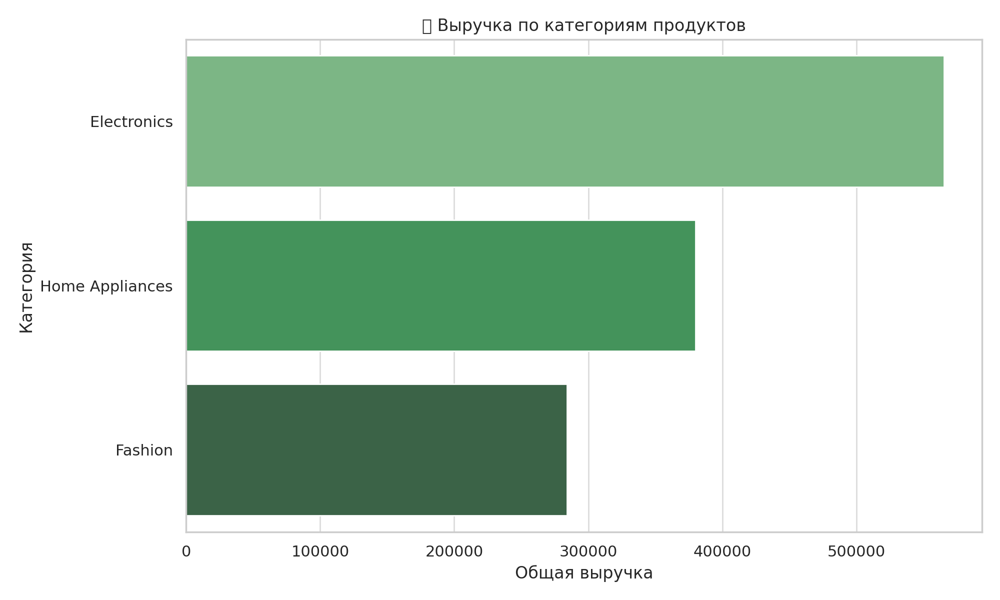
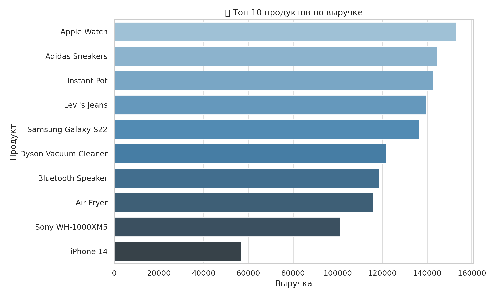
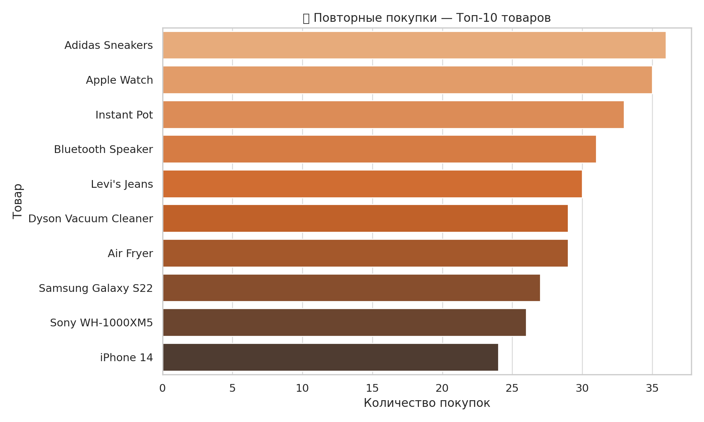

# 📊 Automated Sales Reports (SQL + Python)

This project contains a set of Python scripts that automatically generate business reports from a SQLite database with realistic sales data.  
The scripts simulate real-world analyst tasks and are designed to demonstrate core skills in SQL, pandas, and Excel reporting.

---

## 🗂 Project Structure

```
automated_sales_reports/
├── data/
│   └── sales.db                  ← SQLite database with 300+ sales records
├── reports/
│   ├── category_summary.xlsx     ← Report #1: Revenue by category
│   ├── top_products.xlsx         ← Report #2: Top 10 products by revenue
│   └── repeated_products.xlsx    ← Report #3: Repeated product purchases
├── scripts/
│   ├── category_summary_sql.py   ← Script #1
│   ├── top_products.py           ← Script #2
│   └── repeated_products.py      ← Script #3
├── category_summary_chart.png    ← Chart for category summary
├── top_10_products_chart.png     ← Chart for top products
├── repeated_products_chart.png   ← Chart for repeated purchases
└── README.md
```

---

## 📜 Scripts Overview

| Script | Description |
|--------|-------------|
| `category_summary_sql.py` | Generates a report of total revenue and quantity by product category |
| `top_products.py`         | Extracts top 10 products based on total revenue |
| `repeated_products.py`    | Finds products that were purchased more than once and summarizes their performance |

All reports are saved as `.xlsx` files and ready to send to management.

---

## 📊 Visualizations

### 📦 Revenue by Category



### 💰 Top 10 Products by Revenue



### 🔁 Top 10 Repeatedly Purchased Products



---

## ▶️ How to Run

1. Clone the repository:
   ```bash
   git clone https://github.com/your_username/automated_sales_reports.git
   cd automated_sales_reports
   ```

2. Install dependencies:
   ```bash
   pip install pandas openpyxl
   ```

3. Run any script from the `scripts/` folder:
   ```bash
   python scripts/category_summary_sql.py
   ```

Reports will appear in the `reports/` folder.

---

## 💼 Skills Demonstrated
- SQL (aggregation, grouping, filtering)
- SQLite integration in Python
- Data analysis with `pandas`
- Exporting Excel reports
- Data visualization with `matplotlib` and `seaborn`
- Code structuring & automation
- Git + GitHub workflow

---

## 📌 Note
The project uses SQLite for demonstration purposes, but can be adapted to work with PostgreSQL, MySQL, or other databases.
